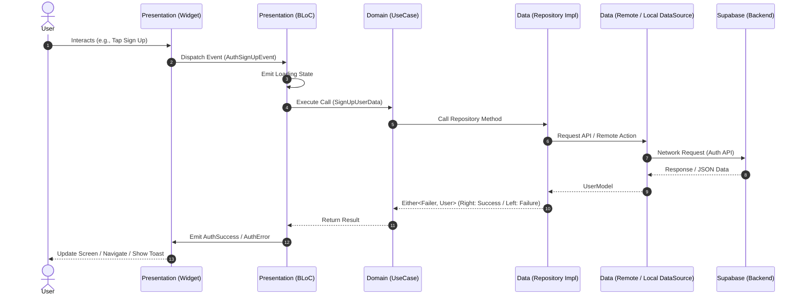

 # 📱 Flutter Blog App — Clean Architecture & BLoC

[](https://flutter.dev/)
[](https://dart.dev/)
[](https://bloclibrary.dev/)
[](https://supabase.com/)
[](#-architecture-overview)
[](LICENSE)

A production-ready, scalable Flutter blog application built adhering to **Clean Architecture** principles, **BLoC** pattern for state management, **fpdart** for functional error handling, **GetIt** for dependency injection, and **Supabase** for backend authentication, database, and cloud storage.

---

## 📑 Table of Contents

- [✨ Features](#-features)
- [🏛️ Architecture Overview](#️-architecture-overview)
  - [Clean Architecture Layers](#clean-architecture-layers)
  - [Data Flow Diagram](#data-flow-diagram)
- [📂 Project Structure](#-project-structure)
- [🛠️ Tech Stack & Libraries](#️-tech-stack--libraries)
- [🚀 Getting Started](#-getting-started)
  - [Prerequisites](#prerequisites)
  - [Supabase Setup](#supabase-setup)
  - [Configuration](#configuration)
  - [Installation & Run](#installation--run)
- [💡 Clean Architecture Best Practices Implemented](#-clean-architecture-best-practices-implemented)
- [🤝 Contributing](#-contributing)
- [📄 License](#-license)

---

## ✨ Features

- 🔐 **User Authentication**: Secure Sign-up and Login using Supabase Auth.
- 💾 **Session Persistence**: Automatic login persistence via `SharedPreferences`.
- 📝 **Create & Publish Blogs**: Upload rich blog posts with titles, topics, detailed content, and featured images.
- ☁️ **Cloud Storage**: Seamless image upload to Supabase Storage buckets with public URL generation.
- 🛡️ **Functional Error Handling**: Type-safe error handling using `Either<Failer, T>` from `fpdart`.
- 💉 **Dependency Injection**: Centralized Service Locator pattern powered by `GetIt`.
- 🎨 **Responsive UI & Theming**: Custom reusable UI widgets with a consistent design system.

---

## 🏛️ Architecture Overview

The project is structured according to **Uncle Bob's Clean Architecture** with a **Feature-First** packaging strategy. This guarantees separation of concerns, testability, and independence from external frameworks and UI.

```
       ┌────────────────────────────────────────────────────────┐
       │                   Presentation Layer                   │
       │             (UI Widgets, Pages, BLoC)                  │
       └─────────────────────────┬──────────────────────────────┘
                                 │
                                 ▼
       ┌────────────────────────────────────────────────────────┐
       │                      Domain Layer                      │
       │    (Entities, Use Cases, Repository Interfaces)        │ ◄── Pure Dart (Core Logic)
       └─────────────────────────▲──────────────────────────────┘
                                 │
                                 │ implements
       ┌─────────────────────────┴──────────────────────────────┐
       │                       Data Layer                       │
       │    (Models, Data Sources, Repository Implementations)  │
       └────────────────────────────────────────────────────────┘
```

### Clean Architecture Layers

1. **Domain Layer (Innermost)**:
   - Contains business logic and domain entities.
   - Completely independent of UI frameworks, database engines, and third-party packages.
   - Defines abstract repository contracts (Dependency Inversion Principle).
   - Use Cases encapsulate single, focused business actions (e.g., `SignUpUseCase`, `UploadBlogUsecase`).

2. **Data Layer**:
   - Implements the repository contracts defined in the Domain layer.
   - Handles communication with remote sources (Supabase) and local storage (SharedPreferences).
   - Models extend domain entities with serialization methods (`fromJson`, `toJson`, `toEntity`, `copyWith`).

3. **Presentation Layer**:
   - Manages UI presentation, user interactions, and reactive state.
   - Built with BLoC (`flutter_bloc`) following unidirectional data flow: `Event -> BLoC -> State -> UI`.

4. **Core Layer**:
   - Reusable utilities, custom failure/exception definitions, base usecase contracts, app-wide theming, and common widgets shared across features.

---

### Data Flow Diagram



---

## 📂 Project Structure

```text
lib/
├── core/                                # Shared modules across features
│   ├── app_errors/                      # Error & Failure definitions
│   │   ├── failer.dart                  # Base failure class for Domain layer
│   │   └── server_exception.dart        # Exceptions for Data layer
│   ├── local_storage/                   # Local storage abstraction (SharedPreferences)
│   │   └── local_storage.dart
│   ├── secrets/                         # Configuration & API secrets
│   │   └── app_secrets.dart
│   ├── theme/                           # App theming and color palettes
│   │   └── app_theme.dart
│   ├── usecase/                         # Base generic UseCase interface
│   │   └── usecase.dart
│   └── utils/                           # Common UI components & helpers
│       └── shared_widgets/
│           ├── app_button.dart
│           ├── app_text.dart
│           └── app_text_field.dart
│
├── features/                            # Feature-first modules
│   ├── auth/                            # Authentication Feature
│   │   ├── data/
│   │   │   ├── data_sources/            # Supabase auth remote data source
│   │   │   ├── models/                  # UserModel (JSON serialization)
│   │   │   └── repository/              # AuthRepoImpl implementation
│   │   ├── domain/
│   │   │   ├── entities/                # User entity
│   │   │   ├── repository/              # AuthDomainRepo contract
│   │   │   └── usecase/                 # SignUpUseCase, LoginUseCase
│   │   └── presentation/
│   │       ├── bloc/                    # AuthBloc, AuthEvent, AuthState
│   │       └── pages/                   # LoginScreen, SignUpScreen
│   │
│   └── home/                            # Blog / Home Feature
│       ├── data/
│       │   ├── data_source/             # BlogRemoteDataSource (Supabase CRUD & Storage)
│       │   ├── models/                  # BlogModel
│       │   └── repository/              # BlogRepoImpl
│       ├── domain/
│       │   ├── entities/                # BlogEntity
│       │   ├── repository/              # BlogRepo contract
│       │   └── usecases/                # UploadBlogUsecase
│       └── presentation/
│           ├── bloc/                    # BlogHomeBloc, BlogHomeEvent, BlogHomeState
│           └── pages/                   # HomeScreen, AddNewBlog
│
├── init_dependency.dart                 # Dependency Injection setup with GetIt
└── main.dart                            # Application entry point
```

---

## 🛠️ Tech Stack & Libraries

| Dependency | Purpose |
| :--- | :--- |
| [**flutter_bloc**](https://pub.dev/packages/flutter_bloc) | State management utilizing BLoC & Event-driven architecture |
| [**supabase_flutter**](https://pub.dev/packages/supabase_flutter) | Backend-as-a-Service for Authentication, Database, & Storage |
| [**get_it**](https://pub.dev/packages/get_it) | Service Locator for Clean Dependency Injection |
| [**fpdart**](https://pub.dev/packages/fpdart) | Functional programming (`Either`, `Option`) for explicit error handling |
| [**shared_preferences**](https://pub.dev/packages/shared_preferences) | Local persistent storage for auth tokens & user session states |
| [**image_picker**](https://pub.dev/packages/image_picker) | Selecting blog cover images from camera or gallery |
| [**uuid**](https://pub.dev/packages/uuid) | Generating unique identifiers for entities and image files |
| [**get**](https://pub.dev/packages/get) | Simplified navigation and context utilities |

---

## 🚀 Getting Started

### Prerequisites

- [Flutter SDK](https://docs.flutter.dev/get-started/install) (Version `^3.9.2` or later)
- [Dart SDK](https://dart.dev/get-dart)
- A [Supabase](https://supabase.com/) project account

---

### Supabase Setup

1. **Create a Supabase Project** at [database.new](https://database.new).
2. **Create `blogs` Table**:
   Execute the following SQL in your Supabase SQL Editor:
   ```sql
   CREATE TABLE blogs (
       id UUID PRIMARY KEY DEFAULT gen_random_uuid(),
       poster_id UUID NOT NULL REFERENCES auth.users(id) ON DELETE CASCADE,
       title TEXT NOT NULL,
       content TEXT NOT NULL,
       image_url TEXT NOT NULL,
       topic TEXT NOT NULL,
       updated_at TIMESTAMP WITH TIME ZONE DEFAULT timezone('utc'::text, now()) NOT NULL
   );

   -- Enable Row Level Security (RLS)
   ALTER TABLE blogs ENABLE ROW LEVEL SECURITY;

   -- Policy: Allow read access to all users
   CREATE POLICY "Allow public read access" ON blogs
       FOR SELECT USING (true);

   -- Policy: Allow authenticated users to insert blogs
   CREATE POLICY "Allow authenticated insert" ON blogs
       FOR INSERT WITH CHECK (auth.uid() = poster_id);
   ```

3. **Create Storage Bucket**:
   - Go to **Storage** -> **New Bucket**.
   - Name the bucket: `blog_images`.
   - Toggle **Public Bucket** to `ON`.
   - Add policy allowing authenticated users to upload files.

---

### Configuration

Add your Supabase credentials in [lib/core/secrets/app_secrets.dart](file:///lib/core/secrets/app_secrets.dart):

```dart
class AppSecrets {
  static const String supabaseUrl = "YOUR_SUPABASE_PROJECT_URL";
  static const String supabaseAnonKey = "YOUR_SUPABASE_ANON_KEY";
}
```

> **Note**: For production environments, consider injecting secrets at build time using `--dart-define` or `.env` files.

---

### Installation & Run

1. **Clone the repository**:
   ```bash
   git clone https://github.com/your-username/blog_app.git
   cd blog_app
   ```

2. **Install dependencies**:
   ```bash
   flutter pub get
   ```

3. **Run the application**:
   ```bash
   flutter run
   ```

---

## 💡 Clean Architecture Best Practices Implemented

- ✅ **Dependency Inversion Principle (DIP)**: High-level use cases depend on repository abstractions (`AuthDomainRepo`, `BlogRepo`), not on concrete implementations or database clients.
- ✅ **Single Responsibility Principle (SRP)**: Each Use Case executes one single task (`LoginUseCase`, `SignUpUseCase`, `UploadBlogUsecase`).
- ✅ **No Framework Leakage in Domain**: The `domain/` directory contains pure Dart code without dependencies on Flutter UI or external packages.
- ✅ **Functional Error Handling with `fpdart`**: Instead of throwing uncaught exceptions to the UI, data sources throw `ServerException`, repositories catch them and return `Either<Failer, SuccessType>`, making errors predictable and strictly typed.
- ✅ **Centralized Dependency Registration**: All datasources, repositories, use cases, and blocs are registered cleanly via `GetIt` in [lib/init_dependency.dart](file:///lib/init_dependency.dart).

---

## 🤝 Contributing

Contributions, issues, and feature requests are welcome!

1. Fork the Project
2. Create your Feature Branch (`git checkout -b feature/AmazingFeature`)
3. Commit your Changes (`git commit -m 'feat: Add some AmazingFeature'`)
4. Push to the Branch (`git push origin feature/AmazingFeature`)
5. Open a Pull Request

---

## 📄 License

Distributed under the **MIT License**. See `LICENSE` for more information.
